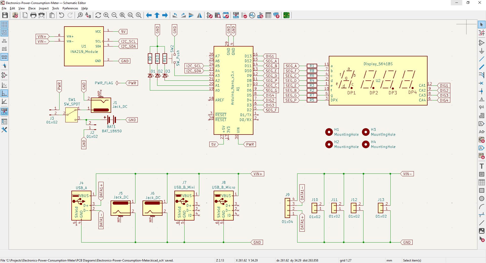
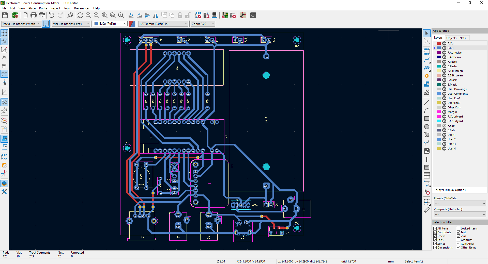
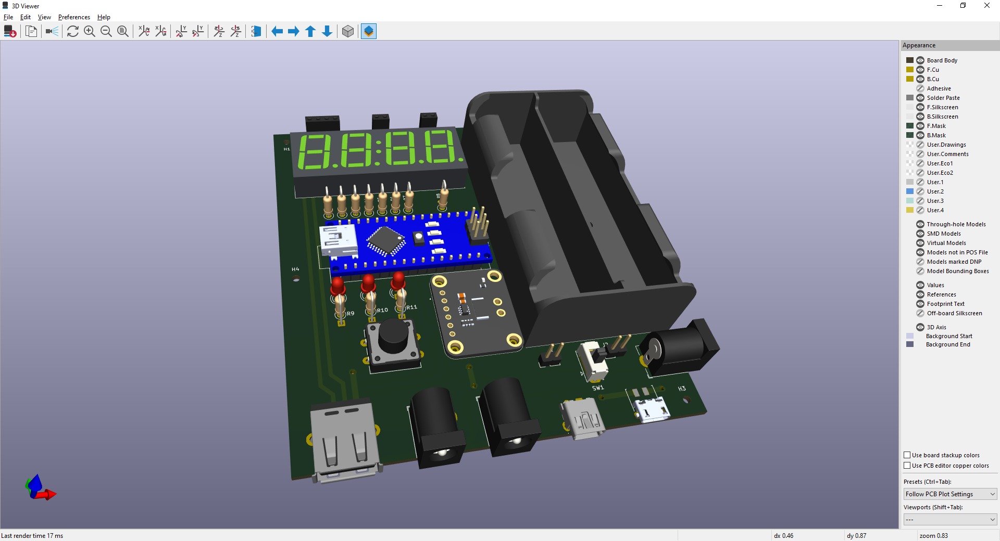
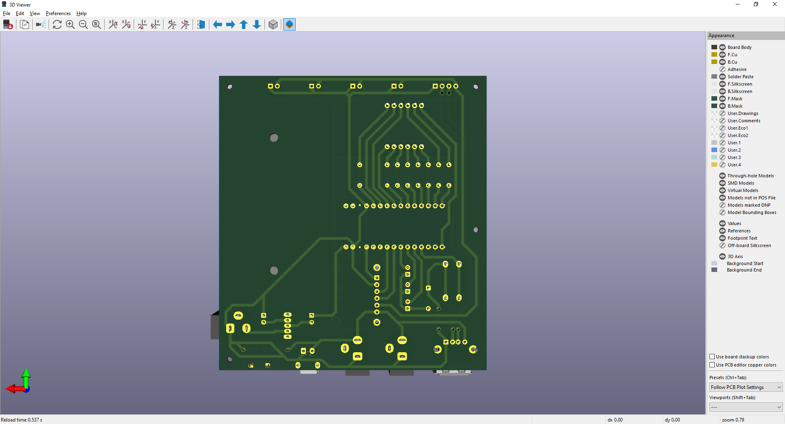

# Electronics Power Consumption Meter

A power consumption meter based on Arduino Nano.  
This project is a **work-in-progress**.

&nbsp;

This project use the following electronic components:
- 1 x Double sided copper clad board (10x11cms)
- 1 x Arduino UNO / Nano v3
- 1 x INA219 module
- 1 x 3461BS-1 display (4 digit, 7 segment multiplexed display)
- 8 x 390 ohm resistors
- 1 x On/Off Button
- 1 x Switch Button (power selector)
- 1 x 18650 Batery x2 holder / 1 x 9V Batery holder
- 1 x DC conector (optional, externar power 5-12V)
- 1 x Push Button (measure selector)
- 4 x Bornier 2-pin
- 1 x USB Type-A conector pair (male/female)
- 1 x USB Type-B Mini conector pair (male/female)
- 1 x USB Type-B Micro conector pair (male/female)
- 2 x DC conector-pair (male/female)

&nbsp;

How to use:
- Conect this gadget between the device to measure and its power source.
- Pressing the push-button changes the measure tu display: voltage (V), consumption (mA), or total power (W).

Features:
- Input: 5-12V
- Measurements: 0-26V @3.2A (max), accuracy: ~1mA

Notes:
- Measure only one divece at a time, all power connectors intenally uses a common bus.

&nbsp;

### Screenshots

| Breadboard                                      | Assembly                                        |
|-------------------------------------------------|-------------------------------------------------|
|                 |                   |

| Schematics Diagram                              |  PCB Diagram                                    |
|-------------------------------------------------|-------------------------------------------------|
|         |                |

| PCB Render 3D                                   | PCB Render 3D                                   |
|-------------------------------------------------|-------------------------------------------------|
|        |         |

| Case 3D Model                                   | Project Final                                   |
|-------------------------------------------------|-------------------------------------------------|
|              |              |

See 'Rescources' sub-folder for more pictures & videos of the project.

&nbsp;

### Version History

v1.0 (2025.12.20) - Initial release.  
v1.1 (2025.12.21) - Adding schematics & PCB.  
v1.2 (2025.12.22) - Update schematics & PCB, adding firmware base code.  

&nbsp;

This source code is licensed under GPL v3.0  
Please send me your feedback about this project: andres.garcia.alves@gmail.com
