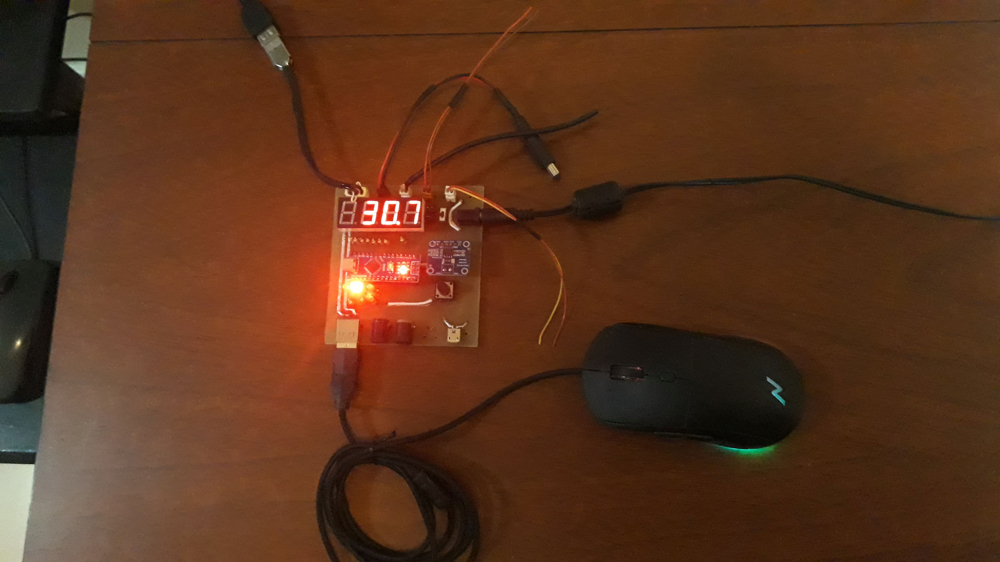
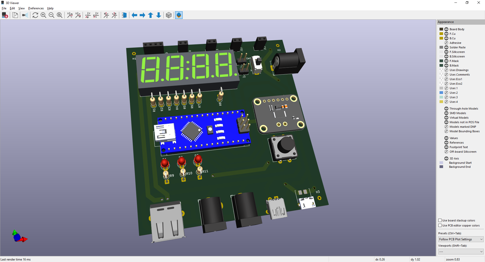
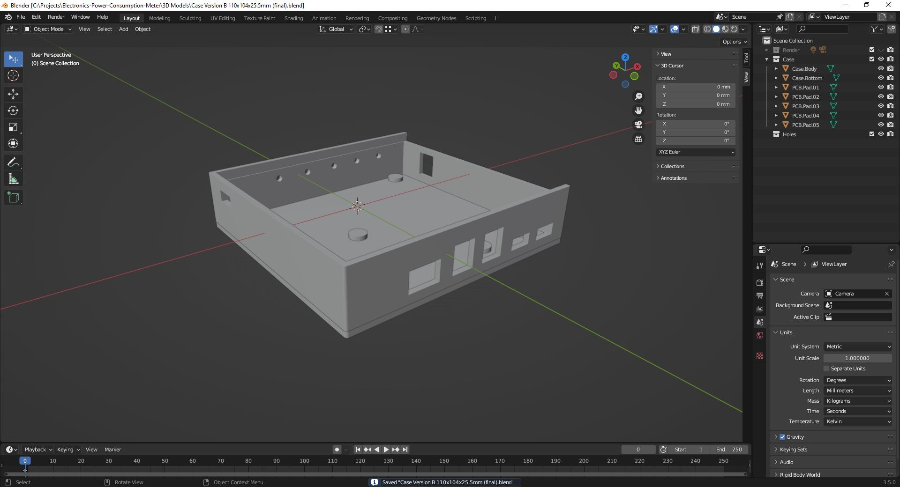

# Power Consumption Meter

A power consumption meter based on Arduino Nano.  
This project is a **work-in-progress**.

Two PCB versions are provided:
- Version A - With Battery Holder
- Version B - Without Battery Holder

&nbsp;

This project use the following electronic components:
- 01 x Double sided copper clad board (9x10cms)
- 01 x Arduino UNO / 01 x Arduino Nano v3
- 01 x Arduino socket (optional, 2x15)
- 01 x INA219 module
- 01 x INA219 socket (optional, 1x6)
- 01 x Display 5641BS, 7-segment, 4 digit, common anode
- 01 x Display socket (optional, 2x6)
- 11 x 470 ohm resistors
- 03 x LED diodes
- 01 x Rocker Button (optional, power on/off) / 01 x Jumper
- 01 x Switch Slide Button (power source selector)
- 01 x Switch Push Button (measure selector)
- 01 x 18650 (x2) batery holder / 01 x 9V Batery holder
- 01 x DC-jack connector (optional, externar power 5-12V)
- 01 x USB Type-A connector pair (male/female)
- 01 x USB Type-B Mini connector pair (male/female)
- 01 x USB Type-B Micro connector pair (male/female)
- 02 x DC connector-pair (male/female)
- 01 x Bornier 4-pin / 01 x JST conector 4-pin
- 04 x Bornier 2-pin / 02 x JST conector 2-pin

How to use:
- Conect this gadget between the device to measure and its power source.
- Pressing the push-button changes the measure tu display: voltage (V), consumption (mA), or total power (mW).

Features:
- Power input: 7-12V
- Measurements: 0-26V @3.2A (max)
- Accuracy: 0.01V, ~1mA, ~1mW

Notes:
- Measure only one device at a time, all power connectors intenally uses a common bus.
- Internal connections:
  - USB-A: power + data
  - USB-B mini/micro: power-only
  - DC-Jacks: power-only

&nbsp;

### Screenshots

| Breadboard                                      | Assembly                                        |
|-------------------------------------------------|-------------------------------------------------|
|              |                |

| Version A - Schematics Diagram                  | Version A - PCB Diagram                         |
|-------------------------------------------------|-------------------------------------------------|
|         |                |

| Version A - PCB Render 3D                       | Version A - PCB Render 3D                       |
|-------------------------------------------------|-------------------------------------------------|
|     |      |

| Version B - PCB Render 3D                       | Version B - PCB Render 3D                       |
|-------------------------------------------------|-------------------------------------------------|
|     |      |

| Case 3D Model                                   | Project Final                                   |
|-------------------------------------------------|-------------------------------------------------|
|              |              |

See 'Rescources' sub-folder for more pictures & videos of the project.

&nbsp;

### Version History

v1.0 (2025.12.20) - Initial release.  
v1.1 (2025.12.21) - Version A: adding PCB schematics and layout.  
v1.2 (2025.12.22) - Version A: update PCB schematics and layout, adding firmware base code.  
v1.3 (2025.12.23) - Version A: update PCB schematics and layout, update firmware.  
v1.4 (2025.12.25) - Version B: adding PCB schematics and layout.  
v1.5 (2025.12.26) - Version A: adding case 3D model, adding 'Stickers' folder.  
v1.6 (2025.12.29) - Adding PCB building and assembly pictures.  
v1.7 (2026.01.27) - Version B: adding case 3D model.  

&nbsp;

This source code is licensed under GPL v3.0  
Please send me your feedback about this project: andres.garcia.alves@gmail.com
